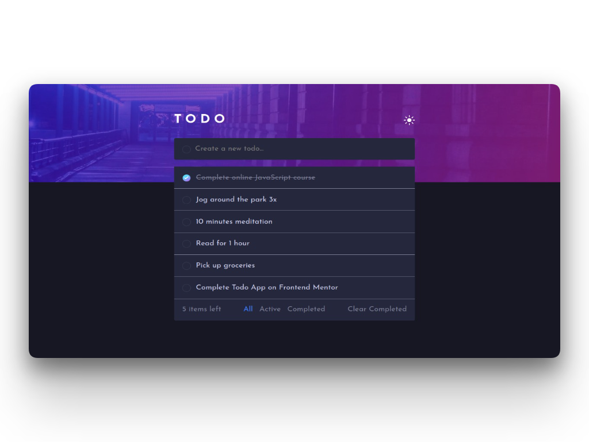

# Frontend Mentor - Todo app solution

This is a solution to the [Todo app challenge on Frontend Mentor](https://www.frontendmentor.io/challenges/todo-app-Su1_KokOW). Frontend Mentor challenges help you improve your coding skills by building realistic projects.

## Table of contents

- [Overview](#overview)
  - [The challenge](#the-challenge)
  - [Screenshot](#screenshot)
  - [Links](#links)
- [My process](#my-process)
  - [Built with](#built-with)
  - [What I learned](#what-i-learned)
  - [Continued development](#continued-development)
  - [Useful resources](#useful-resources)
- [Author](#author)

**Note: Delete this note and update the table of contents based on what sections you keep.**

## Overview

### The challenge

Users should be able to:

- View the optimal layout for the app depending on their device's screen size
- See hover states for all interactive elements on the page
- Add new todos to the list
- Mark todos as complete
- Delete todos from the list
- Filter by all/active/complete todos
- Clear all completed todos
- Toggle light and dark mode
- **Bonus**: Drag and drop to reorder items on the list

### Screenshot



### Links

- Solution URL: [Add solution URL here](https://your-solution-url.com)
- Live Site URL: [Todo App](https://ca-todo.netlify.app)

## My process

### Built with

- Semantic HTML5 markup
- Sass
- Flexbox
- Mobile-first workflow
- [React](https://reactjs.org/) - JS library
- [react-beautiful-dnd](https://github.com/atlassian/react-beautiful-dnd) - a library that allows drag and drop for lists in React

### What I learned

This project helped me to get more familiar with React, especially the useState and useEffect hooks.

This was also my first time using Sass in a React project, which proved to be very straightforward.

For me, the most challenging part of the project was implementing the Drag and Drop feature. Even though it was an optional feature of this challenge, I wanted to give a go and add it to the final app. After some research, I decided to use the existing [react-beautiful-dnd](https://github.com/atlassian/react-beautiful-dnd) library. It provided a simple and effective way to implement this feature.

Another feature I was dreading was the light and dark mode toggle, simply because I had not done it. I broke down this feature into small steps:

1. First, I wrote all the styles in the `style.scss` file. Using the light theme as the default, I simply created a `.dark` class that overwrites the properties that needed to change when switching themes:

```css
.dark {
  background-colour: $clr-dark-neutral-700;
  background-image: url("../public/images/bg-mobile-dark.jpg");
  colour: $clr-dark-neutral-200;

  /* .... */
}
```

2. Then, I implemented the `ThemeSwitcher` component, which is rendered by the main `App` component and is responsible to display the appropriate symbol to change the colour palette.

3. The `App` component is responsible to handle the changing of the theme and applies the class of the selected theme in the `handleChangeMode`

4. After having the basic functionality working, I wanted to somehow persist the user's choice so that when they refresh the page (or return to it) it would still display their desired mode. To achieve this, I made use of JavaScript's [`localStorage`](https://developer.mozilla.org/en-US/docs/Web/API/Window/localStorage) property. With this property, we can set a new item with the selected mode, and then retrieve it when the user refreshes the page or opens a new instance of the app.

```javascript
const [mode, setMode] = useState(null);

// run on load to get the stored theme
useEffect(() => {
  const storedMode = localStorage.getItem("mode");
  if (storedMode) {
    setMode(storedMode);
    if (storedMode === "dark") {
      document.body.classList.add("dark");
    }
  } else {
    setMode("light");
  }
}, []);

// setting the colour mode
function handleChangeMode() {
  if (mode === "dark") {
    setMode("light");
    localStorage.setItem("mode", "light");
  } else {
    setMode("dark");
    localStorage.setItem("mode", "dark");
  }
  document.body.classList.toggle("dark");
}
```

5. Finally, I wanted to add some more detail to this feature. Previously, I stated that by design the Light Mode was the default one, but these days so many people have their devices set with a dark mode (myself included!), so I thought it would have been a nice touch to have this application detecting the user preference even if they are using the app for the first time. This also required some research, but quickly I found out about the `prefers-colour-scheme` CSS media query, which allows us to define CSS rules depending on the colour-scheme the user has set on their device. However, I wanted a Javascript approach and not a CSS one, because even if the user has `prefers-colour-scheme` set to `dark` on their device they could have chosen to use the app in light mode, or vice-versa. To check this, I used the `window.matchMedia` Javascript interface, and use it to check if the user has the `prefers-colour-scheme` media query set to `dark`, and change the theme accordingly.

```javascript
// run on load to get the stored theme
useEffect(() => {
  const storedMode = localStorage.getItem("mode");
  if (storedMode) {
    setMode(storedMode);
    if (storedMode === "dark") {
      document.body.classList.add("dark");
    }
  } else if (storedMode === "light") {
    setMode("light");
  } else if (
    window.matchMedia &&
    window.matchMedia("(prefers-colour-scheme: dark)").matches
  ) {
    setMode("dark");
  } else {
    setMode("light");
  }
}, []);
```

### Continued development

I look forward to keeping using React on my future projects, exploring more of its features and expanding my knowledge of hooks.

For this specific project, I intend to build a back-end using Node and Express and make it a full-stack web application.

### Useful resources

- [W3Schools](https://www.w3schools.com/) - For general reference and React examples.
- [MDN Web Docs](https://developer.mozilla.org/en-US/) - For general JS reference.
- [Lifting State Up](https://reactjs.org/docs/lifting-state-up.html) - This article helped me to overcome the problem of sharing data between sibling components.

- [How do I detect dark mode using JavaScript?](https://stackoverflow.com/a/57795495) - This helped me to learn how to detect the user's prefered colour scheme.
- [Beautiful and Accessible Drag and Drop with react-beautiful-dnd](https://egghead.io/courses/beautiful-and-accessible-drag-and-drop-with-react-beautiful-dnd) - This quick course helped me get started using react-beautiful-dnd.

## Author

- Website - _coming soon_
- Frontend Mentor - [@carlaalmeida](https://www.frontendmentor.io/profile/carlaalmeida)
<!--

# Getting Started with Create React App

This project was bootstrapped with [Create React App](https://github.com/facebook/create-react-app).

## Available Scripts

In the project directory, you can run:

### `npm start`

Runs the app in the development mode.\
Open [http://localhost:3000](http://localhost:3000) to view it in your browser.

The page will reload when you make changes.\
You may also see any lint errors in the console.

### `npm test`

Launches the test runner in the interactive watch mode.\
See the section about [running tests](https://facebook.github.io/create-react-app/docs/running-tests) for more information.

### `npm run build`

Builds the app for production to the `build` folder.\
It correctly bundles React in production mode and optimizes the build for the best performance.

The build is minified and the filenames include the hashes.\
Your app is ready to be deployed!

See the section about [deployment](https://facebook.github.io/create-react-app/docs/deployment) for more information.

### `npm run eject`

**Note: this is a one-way operation. Once you `eject`, you can't go back!**

If you aren't satisfied with the build tool and configuration choices, you can `eject` at any time. This command will remove the single build dependency from your project.

Instead, it will copy all the configuration files and the transitive dependencies (webpack, Babel, ESLint, etc) right into your project so you have full control over them. All of the commands except `eject` will still work, but they will point to the copied scripts so you can tweak them. At this point you're on your own.

You don't have to ever use `eject`. The curated feature set is suitable for small and middle deployments, and you shouldn't feel obligated to use this feature. However we understand that this tool wouldn't be useful if you couldn't customize it when you are ready for it.

## Learn More

You can learn more in the [Create React App documentation](https://facebook.github.io/create-react-app/docs/getting-started).

To learn React, check out the [React documentation](https://reactjs.org/).

### Code Splitting

This section has moved here: [https://facebook.github.io/create-react-app/docs/code-splitting](https://facebook.github.io/create-react-app/docs/code-splitting)

### Analyzing the Bundle Size

This section has moved here: [https://facebook.github.io/create-react-app/docs/analyzing-the-bundle-size](https://facebook.github.io/create-react-app/docs/analyzing-the-bundle-size)

### Making a Progressive Web App

This section has moved here: [https://facebook.github.io/create-react-app/docs/making-a-progressive-web-app](https://facebook.github.io/create-react-app/docs/making-a-progressive-web-app)

### Advanced Configuration

This section has moved here: [https://facebook.github.io/create-react-app/docs/advanced-configuration](https://facebook.github.io/create-react-app/docs/advanced-configuration)

### Deployment

This section has moved here: [https://facebook.github.io/create-react-app/docs/deployment](https://facebook.github.io/create-react-app/docs/deployment)

### `npm run build` fails to minify

This section has moved here: [https://facebook.github.io/create-react-app/docs/troubleshooting#npm-run-build-fails-to-minify](https://facebook.github.io/create-react-app/docs/troubleshooting#npm-run-build-fails-to-minify) -->
